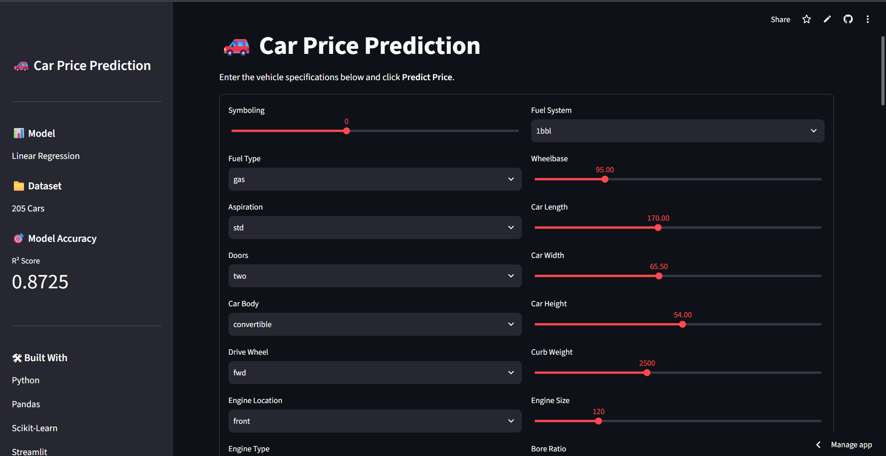
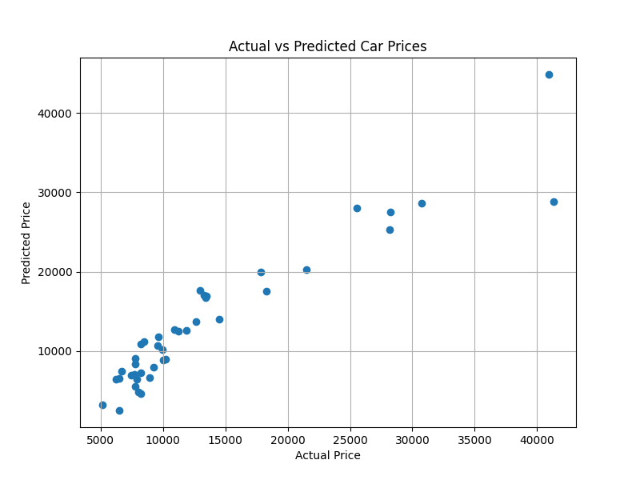
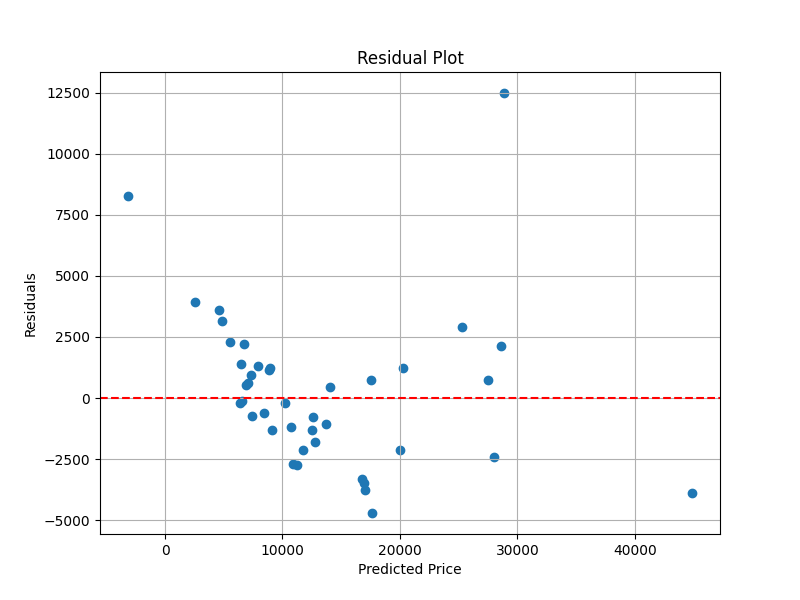

# 🚗 Car Price Prediction using Machine Learning

A Machine Learning web application that predicts the market price of a car based on its specifications.

Built using **Python**, **Scikit-Learn**, and **Streamlit**.

---
## 🚀 Live Demo

https://car-price-prediction-ml-c8gdrbsefzirauv83mbwhf.streamlit.app/

## 📱 Application Preview



## 📌 Features

- Predicts car prices instantly
- Interactive Streamlit web interface
- Machine Learning pipeline using Linear Regression
- Automatic preprocessing with OneHotEncoder
- Supports categorical and numerical features
- Actual vs Predicted visualization
- Residual analysis plot

---

## 🛠 Technologies Used

- Python
- Pandas
- NumPy
- Scikit-Learn
- Matplotlib
- Joblib
- Streamlit

---

## 📂 Dataset

Dataset contains **205 cars** with specifications such as:

- Fuel Type
- Engine Size
- Horsepower
- Car Body
- Wheelbase
- Fuel System
- Compression Ratio
- Mileage
- Drive Wheel
- and many more...

Target Variable:

- **Price**

---

## 📈 Model Performance

| Metric | Score |
|---------|--------|
| Model | Linear Regression |
| MAE | 2244.60 |
| RMSE | 3172.90 |
| R² Score | 0.8725 |

---

## 📊 Visualizations

### Actual vs Predicted



---

### Residual Plot



---

## 🚀 Installation

Clone the repository

```bash
git clone https://github.com/TalhaPatel675/Car-Price-Prediction-ml.git
```

Go to project folder

```bash
cd Car-Price-Prediction-ml
```

Install dependencies

```bash
pip install -r requirements.txt
```

Train the model

```bash
python train.py
```

Run the application

```bash
streamlit run app.py
```

---

## 📸 Application

The application allows users to:

- Select car specifications
- Predict the estimated price
- View model performance
- Analyze prediction graphs

---

## 📁 Project Structure

```
Car-Price-Prediction-ml
│
├── app.py
├── train.py
├── requirements.txt
│
├── data
│   └── CarPrice_Assignment.csv
│
├── models
│   └── car_price_pipeline.pkl
│
├── images
│   ├── actual_vs_predicted.png
│   └── residual_plot.png
│
└── README.md
```

---

## 👨‍💻 Author

**Talha Patel**

GitHub:

https://github.com/TalhaPatel675

---

## ⭐ If you like this project

Give it a ⭐ on GitHub!
